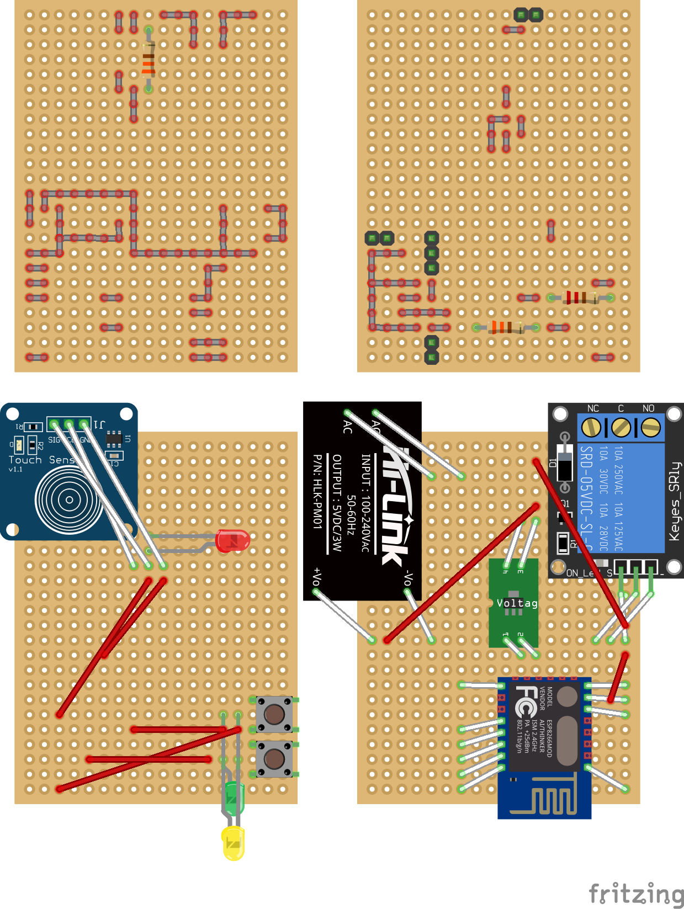

# SingleSwitch

基于 ESP8266-12E/F/S 的单键 WiFi 开关。

## 5x7cm 18x24 双面万能板焊接图

灰色连线为直接焊锡走线，红色连线为飞线。

左上依次为：背面电阻和焊锡走线，正面电阻和焊锡走线；

左下依次为：背面模块放置和飞线，正面元件放置和飞线。

模块为示意，并非使用的实际的模块。其中 ESP8266 会先接转接板（即在 CH_PC 和 GPIO15 接上电阻）。

详细焊接说明可以查看[万能板 Fritzing 文件](Perfboard.fzz)和[焊接标注](Perfboard.xlsx)。
